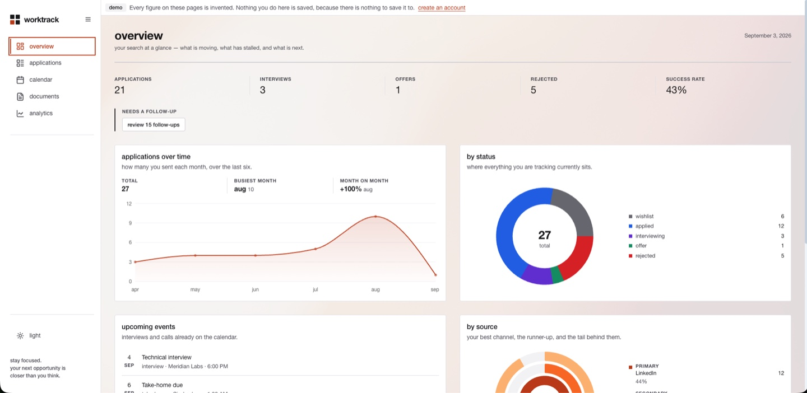
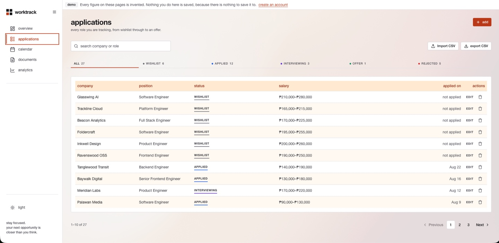
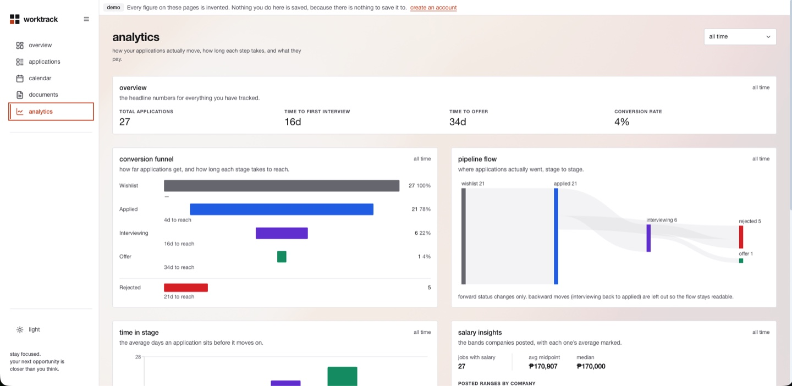
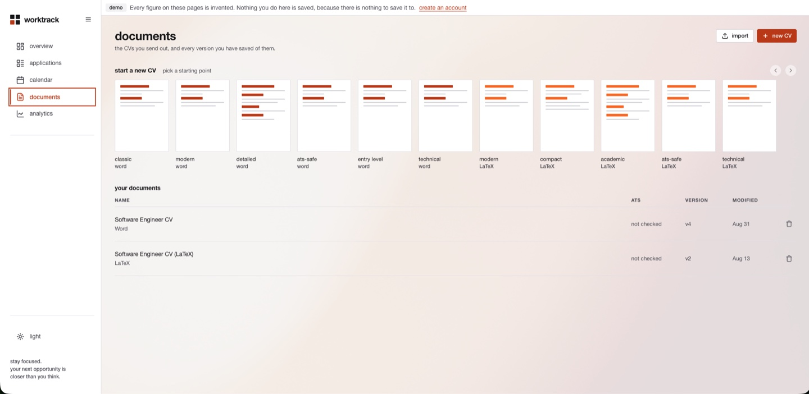

<p align="center">
  <picture>
    <source media="(prefers-color-scheme: dark)" srcset="public/brand/worktrack-mark-dark.svg" />
    
  </picture>
</p>

# Worktrack

**Live: <https://job-search-tracker-analytics-dashbo-one.vercel.app>**

A job search tracker with analytics and a CV builder, built with Next.js 15 (App Router) and React 19 over Supabase Postgres. Worktrack keeps every application, every status change, and every version of your CV in one place, with row-level security scoping every row to its owner.

> **Project lineage.** This repository is the continuation of the [Job Search Tracker & Analytics Dashboard](https://github.com/Ensues/Job-Search-Tracker-Analytics-Dashboard) originally created and built by **[Ensues (Janssen Quiambao)](https://github.com/Ensues)**, who authored the application and its features between March and May 2026. Development continues here under [@NightServant](https://github.com/NightServant). See [Credits](#credits).

## 1. App Overview

Worktrack is a full-stack application with an account behind it, which is the main thing separating it from a spreadsheet: the pipeline, the analytics and the CV history are all views over the same rows, and a status change recorded once shows up in the board, the timeline and the funnel without being entered three times.

Eight routes sit behind authentication — `/dashboard`, `/applications`, `/applications/[id]`, `/calendar`, `/documents`, `/cv`, `/analytics` and `/settings`. In front of it are the landing page at `/`, `/login` and `/signup`, the read-only demo at `/demo/*`, and `/privacy`.

**Data belongs to one person and the database enforces it.** Row-level security is enabled on every table and every policy scopes rows to `auth.uid()`, so a request for someone else's row returns nothing rather than being filtered out afterwards by the interface. That holds even when the application asks for the wrong thing, which is the point of putting it there rather than in a service layer.

**You do not need an account to see the product.** [`/demo/dashboard`](/demo/dashboard) serves the real screens over invented data from `src/lib/demoFixture.ts` — a file in this repository, so there is no session, no database connection and no write path behind those pages. That is a stronger guarantee than a read-only account and a much smaller one to make: no credentials to publish, nothing to vandalise, and `git checkout` is the entire reseeding procedure.

## 2. Brand

### Icon

The Worktrack mark is a 2×2 grid of rounded cells with one cell in the accent colour — a literal reference to one stage of the status pipeline being active. It is not a text-only logo; the mark stands alone at small sizes.

| Asset | Purpose |
|---|---|
| [`public/brand/worktrack-mark-light.svg`](public/brand/worktrack-mark-light.svg) | The mark for light backgrounds — documentation and external material |
| [`public/brand/worktrack-mark-dark.svg`](public/brand/worktrack-mark-dark.svg) | The same mark for dark backgrounds |
| [`src/app/icon.svg`](src/app/icon.svg) | Wired into Next.js as the favicon |
| [`src/components/ui/brand-mark.tsx`](src/components/ui/brand-mark.tsx) | The mark in the app itself |

The two SVG files above exist **only for this README**. The app's mark needs no variants: its three static cells use `currentColor` and its accent cell binds to `var(--color-accent-default)`, so it follows the theme on its own. An `` on GitHub gets neither a CSS context nor an inherited colour, so the two themes need two files and a `<picture>` element to choose between them.

### Color palette

Worktrack is Swiss typography with a single orange accent, and it renders in both themes. Tokens are authored in [`src/index.css`](src/index.css); each semantic token below resolves to a different primitive per theme, which is why the table has two hex columns rather than one.

| Token | Light | Dark | Used for |
|---|---|---|---|
| `--color-accent-default` | `#c2410c` | `#fb923c` | The one accent: primary buttons, active nav, links, the mark's active cell |
| `--color-bg-canvas` | `#ffffff` | `#09090b` | The page ground |
| `--color-bg-surface` | `#fafafa` | `#18181b` | Alternating section grounds, the auth brand panel |
| `--color-text-primary` | `#18181b` | `#fafafa` | Headings and body text |
| `--color-text-secondary` | `#3f3f46` | `#d4d4d8` | Supporting copy |
| `--color-border-subtle` | `#e4e4e7` | `#27272a` | Hairline rules between rows and sections |
| `--color-border-default` | `#d4d4d8` | `#3f3f46` | Field borders |

Two rules are load-bearing rather than stylistic. **Orange-500 is absent from the codebase**: it fails AA against both of its foregrounds, so the accent resolves to orange-700 in light and orange-400 in dark, each of which clears it. And **the radius is capped at 4px everywhere** — this system separates things with hairline rules rather than rounded, shadowed cards, so a softer corner on one control reads as a different design system. A test fails any component that exceeds either.

## 3. Screens

Captured from the running application, not mocked up.

| | |
|---|---|
|  |  |
| **`/dashboard`** — what is moving, what has stalled, what is next | **`/applications`** — the pipeline as a board or a table |
|  |  |
| **`/analytics`** — conversion, time-in-stage and source trends | **`/documents`** — CV versions and what was sent where |


**`/calendar`** — interviews, deadlines and take-homes.

## 4. Demo

[`/demo/dashboard`](/demo/dashboard) — the app's real screens over invented data. No account, no sign-in, nothing to enter.

It is a public URL space rather than a shared account. Every figure comes from `src/lib/demoFixture.ts`, so the routes are statically rendered and opening the demo serves HTML rather than a spinner.

The screens' write controls (new application, import, delete) still render, because they are the *real* screens rather than a reduced copy. They explain themselves instead of writing: silence would be indistinguishable from a broken button.

The dates move with the clock. A fixture pinned to literal dates would say "applied 8 months ago" by spring, and the six-month trend chart would run off its own left edge.

## 5. Features

### Job tracking
- Applications with company, role, salary range, location, work mode, source, tags, and tech stack
- Status pipeline — wishlist → applied → interviewing → offer / rejected — with drag-and-drop
- Automatic status-change history, recorded by a database trigger rather than by the client, so a transition cannot be lost by a failed request
- Auto-fill from a job posting URL, parsed server-side across multiple job boards
- Filtering, search, sorting, and CSV export

### Analytics
- Conversion and offer rates, applications over time, status distribution
- Time-in-stage metrics, conversion funnels, and source trends
- Precomputed metrics cached in Postgres behind an edge function (stale-while-revalidate)
- Every figure is computed from your own rows, so it is only ever as good as what you put in

### CV builder
- Word-style rich text editor (Tiptap) with autosave
- LaTeX source editor with live side-by-side preview
- Template presets for both modes
- Version history — snapshots capped at 10 per CV
- PDF export via edge function
- An ATS check that reads the document rather than guessing at it

### Accounts
[Sign in](/login) or [create an account](/signup). Registration is three steps — credentials, a six-digit code sent to the address, then the dashboard — with the password rules shown on the form and checked as you type.

The same rules are enforced by the database and not only by the browser: `minimum_password_length` and `password_requirements` in [`supabase/config.toml`](supabase/config.toml) mirror `src/lib/credentials.ts`, because a rule the browser enforces and the server does not is a rule anyone can skip with `curl`. Google and Microsoft are offered as providers.

Email addresses are normalised — trimmed and lowercased — before anything leaves the browser. Without that, `Gabe@example.com` and `gabe@example.com` are two accounts, and walking the case permutations of one address is a way to create a great many rows that all belong to one person.

## 6. Localhost Installation

Worktrack requires **Node.js 18+**, a Supabase project, and the [Supabase CLI](https://supabase.com/docs/guides/local-development).

```bash
git clone <repository-url> worktrack
cd worktrack

npm install
cp .env.example .env      # then fill in the two Supabase values
npm run dev
```

The dev server starts at <http://localhost:3000>.

Apply the schema before first use:

```bash
supabase link --project-ref <your-project-ref>
supabase db push
npm run seed:demo         # optional; populates the demo account
```

Other scripts:

```bash
npm run build              # production build
npm start                  # serve the production build
npm run lint               # eslint
npm test                   # the unit suite, single run
npm run test:watch
npm run test:integration   # against a live Supabase project; needs .env
npx tsc --noEmit           # types, including every test file
```

`tsc` covers `src/**/__tests__/**` deliberately. The exclusion that used to hide type errors in test files is gone, and a guard test fails if it comes back.

Two things about the local setup look decorative and are not, each of which cost a debugging round:

- **Stop the dev server before `npm run build`.** They share `.next`, and running both at once fails the build with `Cannot find module for page: /settings` — an error that names a route and has nothing to do with that route.
- **`npm run lint` walks into `venv/`.** It is `eslint .`, and the Python analysis virtualenv in the working tree is not excluded, so it reports thousands of problems from bundled matplotlib JavaScript. Lint the files you changed until the flat config ignores it.

No test count is quoted anywhere in this file, on purpose: the previous README claimed one that was wrong within a day and stayed wrong for a milestone. `src/lib/__tests__/attribution.test.ts` now fails any attempt to put a figure back.

## 7. Configuration

| Variable | Effect when unset |
|---|---|
| `NEXT_PUBLIC_SUPABASE_URL` | The app cannot reach the database. Required. |
| `NEXT_PUBLIC_SUPABASE_ANON_KEY` | The app cannot authenticate. Required. |
| `SUPABASE_AUTH_SITE_URL` | Only read by `supabase config push`. It has **no default on purpose**: an unset value fails the push loudly rather than pointing production auth emails at `localhost`. |

`NEXT_PUBLIC_SUPABASE_ANON_KEY` is in the client bundle, and that is correct. Next inlines any `NEXT_PUBLIC_` variable, the anon key is designed to be public, and row-level security — not key secrecy — is what protects the data. Never put the service-role key behind that prefix; it bypasses RLS entirely.

### Auth configuration

Auth settings live in [`supabase/config.toml`](supabase/config.toml) and the email templates beside it, so they are reviewable and revertible rather than clicked into a dashboard:

```bash
SUPABASE_AUTH_SITE_URL=https://your-deployed-origin npx supabase config push
```

**Read [`docs/SECURITY.md`](docs/SECURITY.md) before running that.** `config push` sends the whole file, and the file was generated from CLI defaults, so anything left at a default overwrites what the dashboard currently has.

The signup OTP will not work on a stock Supabase project. The default "Confirm signup" template contains `{{ .ConfirmationURL }}` and no token, so no code is ever sent and verification fails against a code that never existed. [`supabase/templates/confirmation.html`](supabase/templates/confirmation.html) is the fix, and the `config.toml` entry is what applies it.

### Deployment

Vercel. Import the repository, set the two `NEXT_PUBLIC_SUPABASE_*` variables, and deploy. The landing page, `/privacy` and the 404 are statically prerendered; the authenticated routes render on demand.

## 8. Engineering

**Row-level security on every table.** Twelve tables, twelve `ENABLE ROW LEVEL SECURITY`, and every policy scoped to `auth.uid()`.

**Every edge function authenticates its caller.** Three of the four did; `job-url-autofill` did not, while fetching arbitrary external URLs server-side — a fetch proxy on our infrastructure open to anyone who found the URL. The trap worth naming is that Supabase's platform-level `verify_jwt` would not have caught it: **the anon key is itself a valid JWT and it is public by design**, so a gate that only asks "is this a valid JWT" admits the entire internet. Only `getUser()` separates a signed-in person from anyone who has read the client bundle. `src/__tests__/edgeFunctionAuth.test.ts` now fails any function that omits it.

**Tests are written before the code, and proved to have teeth.** The habit that matters is not the count but the check: a test that cannot fail is worse than no test, so a new guard is verified by reverting the fix and watching it go red. Several tests in this repository exist because an earlier version passed against broken code.

**Constraints are enforced by tests, not by convention.** No `lucide-react` import, no radius above 4px, no `orange-500`, no colour literal in the auth brand panel, no type size picked outside the landing page's contract, and no privacy-policy claim about a table the schema does not have.

## 9. Data analysis

An optional Python script produces statistics and charts from exported CSV data.

```bash
python3 -m venv venv
./venv/bin/pip install pandas matplotlib seaborn
cd scripts && ../venv/bin/python data_analysis.py
```

Export your applications as CSV and place the file in `scripts/`. Without one, the script runs on built-in sample data and reports fabricated numbers — check the output for the "Generating sample data" notice.

## 10. Project structure

```
src/
├── app/            Next.js App Router
│   ├── (app)/      authenticated routes and their shell
│   ├── (auth)/     /login and /signup
│   ├── demo/       the public read-only route space
│   ├── privacy/    the privacy page
│   └── not-found.tsx
├── components/
│   ├── ui/         the design system (shadcn base-nova, retokened)
│   ├── icons/      AnimateIcons, behind one barrel
│   ├── landing/    the landing page and its sections
│   ├── auth/       the auth screens and the registration flow
│   ├── shell/      sidebar, bottom nav, app chrome
│   ├── brand/      provider marks; fixed artwork, not design-system icons
│   ├── v1/         vendored third-party sources, credited below
│   └── …           analytics, applications, calendar, cv, documents, settings
├── contexts/       auth, theme, toast
├── hooks/          data hooks over TanStack Query
├── lib/            Supabase client, credentials, rate limiting, helpers
└── services/       data access, validation, templates, analytics
supabase/
├── functions/      Deno edge functions
├── migrations/     ordered SQL migrations
├── templates/      auth email templates
└── config.toml     auth configuration, applied with `supabase config push`
scripts/            demo seeding and the Python analysis
docs/               SECURITY.md and the milestone plans
```

## 11. Stack

| Layer | Technology |
|---|---|
| UI | React 19, TypeScript, Next.js 15 (App Router) |
| Components | shadcn/ui (`base-nova` style, built on Base UI) |
| Icons | AnimateIcons |
| Styling | Tailwind CSS v4, semantic design tokens in `src/index.css` |
| Motion | motion (formerly framer-motion) |
| Data fetching | TanStack Query v5 |
| Editor | Tiptap |
| Charts | Recharts 3 |
| Database | PostgreSQL (Supabase) |
| Auth | Supabase Auth |
| Server-side | Supabase Edge Functions (Deno) |
| Testing | Vitest, React Testing Library |
| Analysis | Python (pandas, matplotlib, seaborn) |

### Database

Twelve tables, RLS enabled on all of them:

| Table | Purpose |
|---|---|
| `jobs` | Applications, with description, currency, contact and tag fields |
| `job_status_history` | Append-only status transitions, written by trigger |
| `activity_log` | Free-form timestamped notes per application |
| `events` | Interviews, deadlines, take-homes |
| `resumes` | CV drafts; structured sections, Tiptap JSON, or LaTeX |
| `resume_snapshots` | Immutable version history |
| `application_documents` | Which CV snapshot was sent to which application |
| `contacts` / `application_contacts` | Recruiters and referrals, linked many-to-many |
| `user_preferences` | Per-user settings; default currency for new applications |
| `analytics_cache` | Precomputed per-user metrics, service-role only |
| `demo_accounts` | Read-only demo users, enforced by RLS |

### Edge functions

Deno, in `supabase/functions/`:

| Function | Purpose |
|---|---|
| `job-url-autofill` | Fetches and parses job postings into form fields |
| `analytics-cache-proxy` | Reads cache, computes on miss, upserts result |
| `resume-export-pdf` | Renders a CV to PDF |
| `_shared` | Common headers and telemetry helpers |

## 12. Limitations

- **The signup OTP needs a dashboard change to work.** `supabase/config.toml` carries it, but nothing takes effect until `supabase config push` is run against the project. Until then the code is never sent.
- **Client-side rate limiting is an affordance, not a boundary.** `src/lib/authRateLimit.ts` throttles repeated attempts from one browser and anyone with a console walks past it. The real boundary is server-side, and `docs/SECURITY.md` tables the dashboard controls that have to be switched on.
- **`/` redirects a signed-in visitor after hydration, not before.** The session lives in `localStorage`, so there is no auth cookie for middleware to read, and the landing page paints for a frame before the redirect. Removing that frame needs cookie-backed sessions via `@supabase/ssr`, which is a migration rather than a fix.
- **`resumes.sections` is never written**, so the ATS column reads "not checked" for CVs created through the editors.
- **No accessibility audit has been done.** Keyboard navigation and `aria-current` are handled on the primary surfaces, `prefers-reduced-motion` is honoured throughout, and colour is never the only carrier of state — but a full screen-reader pass has not happened.
- **The pinned landing sequence is desktop-only.** Below `lg` nothing pins; the page scrolls normally, which is deliberate rather than unfinished.

## 13. Roadmap

Done since this list was last written: the Next.js and Vercel migration, the design-system pass, the landing page, the auth rebuild, and the demo.

- [ ] Break up the oversized page components
- [ ] Grammar and spelling checks in the CV editor
- [ ] AI-assisted CV tailoring against a job description
- [ ] Cookie-backed sessions, so `/` can decide server-side rather than after hydration

## Attribution

Third-party components and assets vendored into this repository, credited when adopted:

- **shadcn/ui** — MIT, [ui.shadcn.com](https://ui.shadcn.com). Component source copied into `src/components/ui/` under the `base-nova` style and edited to this project's tokens.
- **AnimateIcons** — MIT, [github.com/Avijit07x/animateicons](https://github.com/Avijit07x/animateicons). Icon components vendored via the shadcn CLI into `src/components/icons/`.
- **mammoth.js** — BSD-2-Clause, [github.com/mwilliamson/mammoth.js](https://github.com/mwilliamson/mammoth.js). An npm dependency rather than vendored source. Converts uploaded `.docx` files to HTML on the Documents screen, which `src/lib/documentImport.ts` walks into the editor's content. Chosen because it maps Word's *styles* rather than its formatting: Word marks a heading by naming a style, not by making text large, so a converter that reads formatting turns a CV into bold paragraphs.
- **Arimo** — SIL Open Font License 1.1, self-hosted via `next/font`. The metric-compatible fallback for Helvetica Neue, which is licensed and cannot be self-hosted.
- **Hero video and its poster still** — [Pexels Licence](https://www.pexels.com/license/), free for commercial use with no attribution required; credited here anyway, as this repository credits third-party assets regardless. [Video 3129671](https://www.pexels.com/video/3129671/), vendored as `public/hero.mp4` (1280x720, H.264) and `public/hero-poster.jpg`. Rendered desaturated: this design system carries a single orange accent, and a second saturated hue behind the headline would make the accent read as one colour among several.
- **App backdrop photograph** — [Unsplash Licence](https://unsplash.com/license), photo by **Albert Salim** ([@albertsalim](https://unsplash.com/@albertsalim)), [photo-1751601454754](https://unsplash.com/photos/blurred-colors-blend-together-in-a-soft-abstract-pattern-XV7OUFLfB8Q). Vendored as `public/backdrop.jpg` and rendered by `AppBackground`. The licence does not require attribution; this repository credits third-party assets regardless.

### Skiper UI

UI components adapted from [Skiper UI](https://skiper-ui.com/components). Skiper
UI's free tier requires attribution, and the registry copies source in-tree
rather than installing a package, so the obligation attaches to the files below.
These two sentences are asserted verbatim by `src/lib/__tests__/attribution.test.ts`
and rendered by the landing footer, so the credit cannot drift from the code.

- Carousel adapted from Skiper UI (Creative carousel 002), built on Swiper.js, with illustrations by AarzooAly.
- Smooth caret input adapted from Skiper UI (Smooth caret input).

The theme toggle is not a Skiper component. It was written from scratch against
the technique in Skiper UI's theme toggle buttons — themselves adapted from
[toggles.dev](https://toggles.dev) by Alfie Jones — and the View Transition
theme wipe follows the approach in `rudrodip/theme-toggle-effect`. Neither
component's source ships here, so neither carries an attribution obligation;
both are named because the ideas are theirs.

---

## Credits

**Original author** — [Ensues (Janssen Quiambao)](https://github.com/Ensues) designed and built this application: the job tracker, analytics dashboard, CV builder, edge functions, and test suite.

**Current maintainer** — [@NightServant](https://github.com/NightServant), continuing development from August 2026: repository and branch consolidation, database migration history, schema fixes, and ongoing feature work.

Run `git shortlog -sne --all` for the full contribution breakdown.
